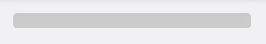
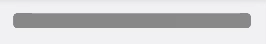

# Placeholder

"Skeleton views" are a common practice for loading content that, following the deprecation of [Accompanist Placeholder](https://google.github.io/accompanist/placeholder), provides the original implementation.

For example usage view the [Previews](../src/main/java/com/michiganlabs/hoverboard/compose/placeholder/PlaceholderPreviews.kt)

## Parameters

 * **visible** - whether the placeholder should be visible or not.
 * **color** - the color used to draw the placeholder UI.
 * **shape** - desired shape of the placeholder. Defaults to `RectangleShape`.
 * **highlight** - optional highlight animation.
    * Pre-defined Available Options
        * `PlaceholderHighlight.fade`

            
        * `PlaceholderHighlight.shimmer`

            
 * **placeholderFadeTransitionSpec** - The transition spec to use when fading the placeholder on/off screen. The boolean parameter defined for the transition is [visible].
 * **contentFadeTransitionSpec** - The transition spec to use when fading the content on/off screen. The boolean parameter defined for the transition is [visible].
